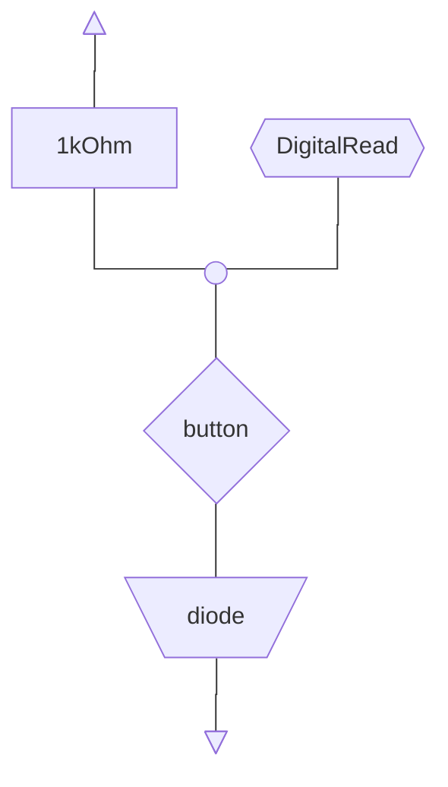
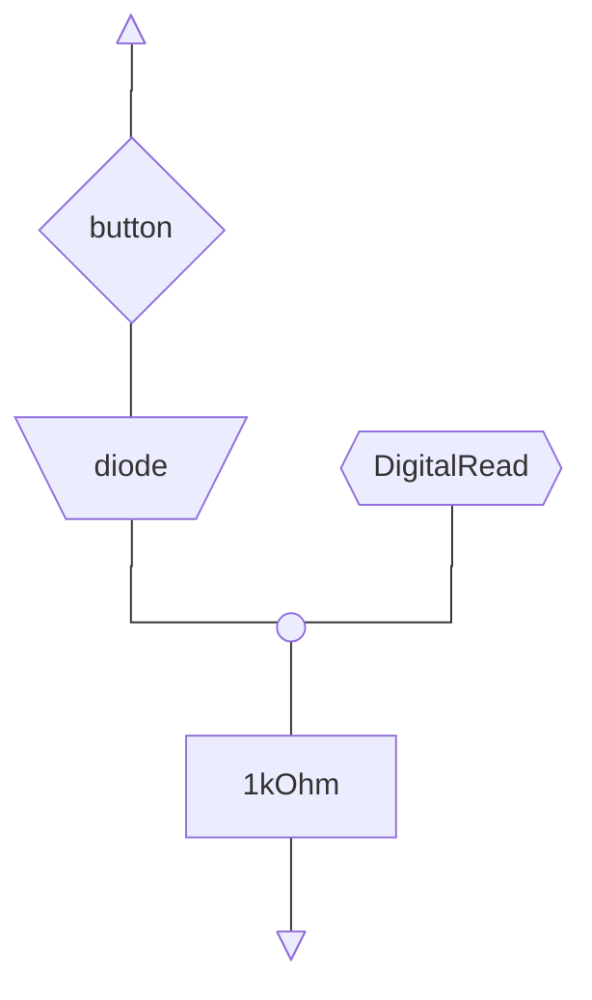
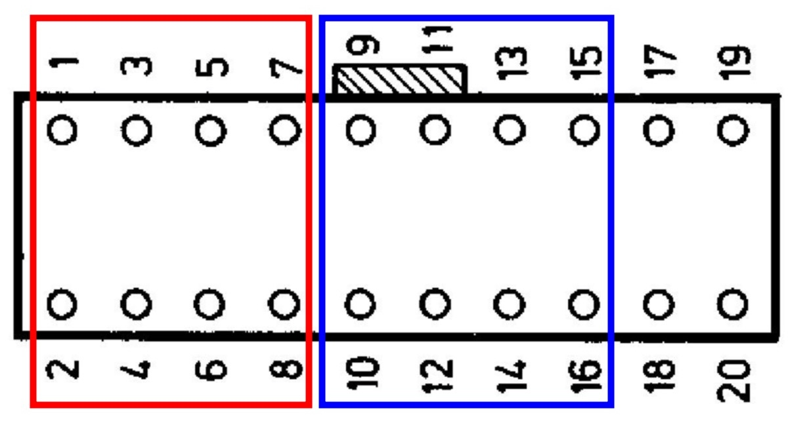
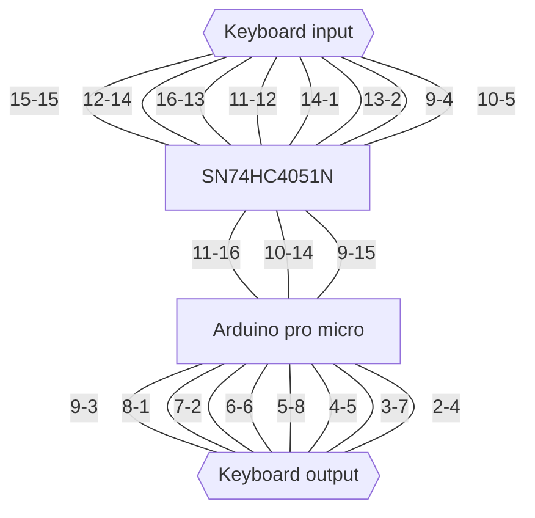
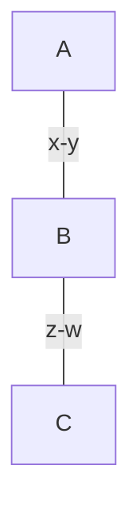

# MIDI-NMS_1160-08
My documentation for a MIDI controller for the Philips NMS 1160/08 matrix keyboard for MSX 

# Reference documentation

The service manual is present in the [Internet Archive](https://archive.org/details/philipsnms12051160sm), a local copy is kept in this repo as well at [philipsnms12051160sm.pdf](assets/philipsnms12051160sm.pdf)

Based on this reference, pins **1**-**8** are used to activate the scan columns, while pins **9**-**16** are used for scanning the rows.

Pins 17-20 are not used

## Key reading logic

The scan can be performed using two different configurations for the input

### `INPUT_PULLUP`


### `INPUT_PULLDOWN`


Either of the two logics can be used, note that:
- The first schematics uses a pullup resistor, all Arduino-compatible boards should support the use of builting pullup resistors for input using pinMode `INPUT_PULLUP`, making it easy to build a more compact circuit
- Only some implementations support pinMode `INPUT_PULLDOWN` so if you plan on using it check that your chipset supports it
- By using `INPUT_PULLUP` the in-memory representation of the keyboard state becomes more intuitive (look at [Notes Logic](#pullup-vs-pulldown))
- If you use `INPUT_PULLUP` remember that the state is the opposite of what you would normally expect (Pressed == LOW)

## Pin mapping

The official documentation repotrs the pin numbering for the keyboard connector (On the MSX side)


- In <b style="color: red;">RED</b> are the input pins for the keyboard (used to enable the scan columns)
- In <b style="color: blue;">BLUE</b> are the output pins, connected directly to the arduino

## Notes Logic

This project uses a multiplexer to control the keyboard since the pro micro has a limited number of pins, the 1160-08 is a [keyboard matrix](https://en.wikipedia.org/wiki/Crossbar_switch) with diods to avoid phantom keys, which means to be able to scan the entire keyboard it is necessary to perform multiple scans by enabling one row at a time and reading the state of buttons in that row.

The multiplexer can be used either to select which row to enable for read, and reading all buttons in the row, or the other way around, to enable the columnt to read and by reading all buttons in a column (**WARNING**: remember that if you use one configuration the multiplexer should output a low voltage (acting as vcc in the graph above), while in the other one it should output an high voltage (acting as gnd in the graph above))

This project uses the multiplexer in the second configuration, to create the ground reference (later the output of the multiplexer is connected to ground to make the circuit simpler).

### PULLUP vs PULLDOWN
Why using the `INPUT_PULLUP` and not the `INPUT_PULLDOWN`?

The way the keyboard is wired makes it so that using a multiplexer for ground reference enables a chunk of 8 subsequent keys for read, while using the multiplexer for vcc reference enables the first key of each chunk, the internal representation in the program is a vector of 8-bit integers, each representing a chunk, with the states of keys in that chunk.
Using the pullup circuit made the code more comprehensible at the cost of inverting the bit logic for each read (which is solved by simply flipping the status bits before returning the read value ([Line 92](keyboard_midi_controller/keyboard_midi_controller.ino#92))).

## Components
I am using an **Arduino pro micro** (MEGA32U4) and a **SN74HC4051N** multiplexer, but any equivalent board/component can be used

## Connections

I found comfortable to keep the two components on a single soldering board side by side (Looking at your board the components should look like this (labels with the correc orientation))


The multiplexer should have the circle on the left and the arduino the microUSB on the right

Pin numbering in th emultiplexer starts from the bottom left corner, proceding counterclockwise (so the bottom-left pin is pin 1, going right up to pin 8, while the top-right pin is pin 9, going left up to pin 16)

Connections are as follow



HUH?! how do I read this?

### How to read this



Pin `x` of `A` is to connect with pin `y` of `B`, pin `z` of `B` is to connect with pin `w` of `C`

In short (`A.x` --> `B.y`,  `B.z` --> `C.w`, and so on)

## Multiplexer power

Additionally, multiplexer's pin `16` is to connect with the `5v` power line, while pins `3`, `6`, `7` and `8` are to connect with `gnd`

## LAST_BLOCK_CONTROL

To extend the range of the keyboard, the last read block (Last *C#* to end of the keyboard) can be used to shift the octave or change the MIDI channel, at the expense of these keys. This is the default behavior, using 1-octave shifts up to 4 shifts cicling, and supporting up to 4 MIDI channels

To disable this behavior set `LAST_BLOCK_CONTROL` to `false`

Other variables that can be configured to modify the control block behavior:

- `MIDI_C0`: set the lowest possible key on the keyboard, default is `12`, corresponding to the MIDI note C0.
- `PITCH_SHIFT_MAX`: set the wrap modulo for the shift, default is `4`, meaning the shifts are 0,1,2,3 after which they wrap back to 0.
- `SEMITONES_SHIFT`: set the amount of semitones to add for each shift, default is `12`, a whole octave, but could use any other number (e.g.: set it to 2 to have the piano's white keys mapped to the scales of **C**, **D**, **E**, **F#** respectlively on the 4 shifts).
- `CHANNEL_MAX`: the maximum MIDI channel, up to 16 maximum, gives you access to channels `0` to `CHANNEL_MAX - 1`, more than 4 is overkill usually, default is `4`.

## Use the control block

When the control block is enabled, the last 5 Keys behave as shown here

```
// ##########################
// ##########################
// . .   |  |#| |#|  |   |###
// . .   |  |#| |#|  |   |###
// . .   |  |#| |#|  |   |###
// . .   |  | | | |  |   |###
// . .   |  |A| |C|  |   |###
// . .   |   |   |   |   |###
// . .___|___|_B_|_D_|_E_|###
// ##########################
// ##########################
```

**A**: Lower pitch shift (wrap)

**B**: <t style="color: red;">not used</t>

**C**: Raise pitch shift (wrap)

**D**: Previous MIDI channel (wrap)

**D**: Next midi channel (wrap)