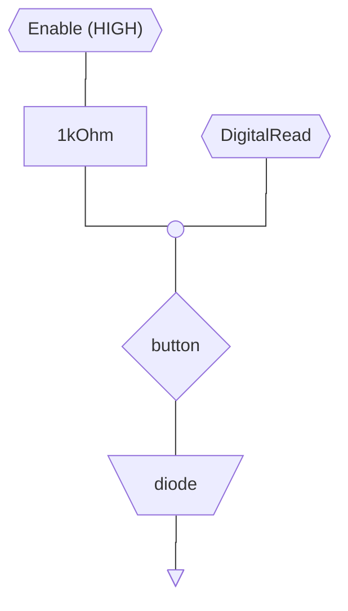
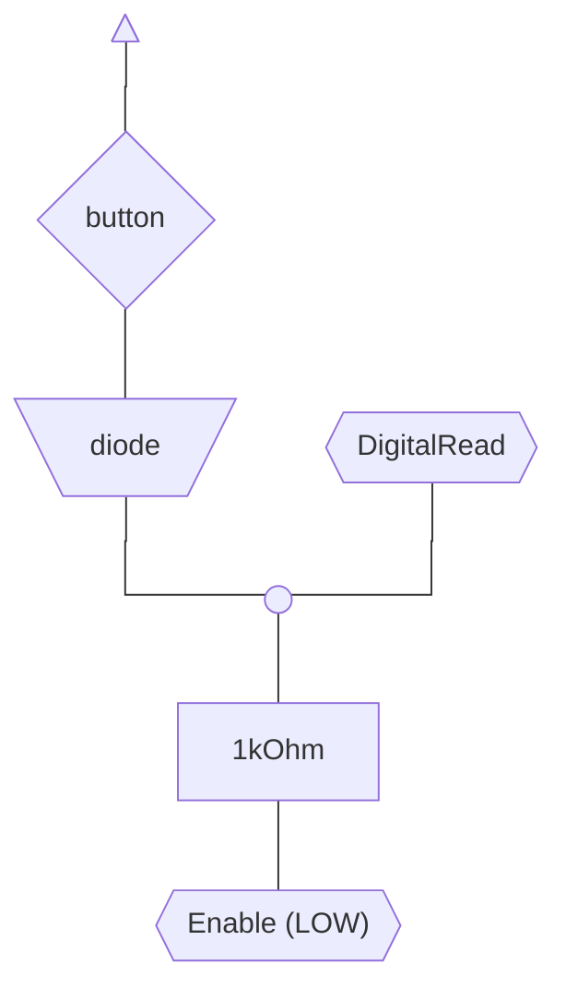

# MIDI-NMS_1160-08
My documentation for a MIDI controller for the Philips NMS 1160/08 matrix keyboard for MSX 

# Reference documentation

The service manual is present in the [Internet Archive](https://archive.org/details/philipsnms12051160sm), a local copy is kept in this repo as well at [philipsnms12051160sm.pdf](assets/philipsnms12051160sm.pdf)

Based on this reference, pins **1**-**8** are used to activate the scan columns, while pins **9**-**16** are used for scanning the rows.

Pins 17-20 are not used

## Key reading logic

The scan can be performed using two different configurations for the input

### `INPUT_PULLUP`

### `INPUT_PULLDOWN`

Either of the two logics can be used, note that:
- The first schematics uses a pullup resistor, all Arduino-compatible boards should support the use of builting pullup resistors for input using pinMode `INPUT_PULLUP`, making it easy to build a more compact circuit
- Only some implementations support pinMode `INPUT_PULLDOWN` so if you plan on using it check that your chipset supports it
- By using `INPUT_PULLUP` the in-memory representation of the keyboard state becomes more intuitive (look at [Notes Logic](#notes-logic-placeholder))
- If you use `INPUT_PULLUP` remember that the state is the opposite of what you would normally expect (Pressed == LOW)

## Pin mapping

The official documentation repotrs the pin numbering for the keyboard connector (On the MSX side)

- In <b style="color: red;">RED</b> are the input pins for the keyboard (used to enable the scan columns)
- In <b style="color: blue;">BLUE</b> are the output pins, connected

## Notes Logic PLACEHOLDER